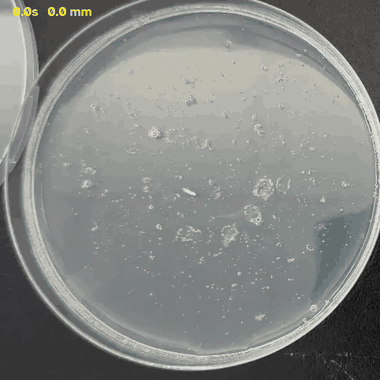
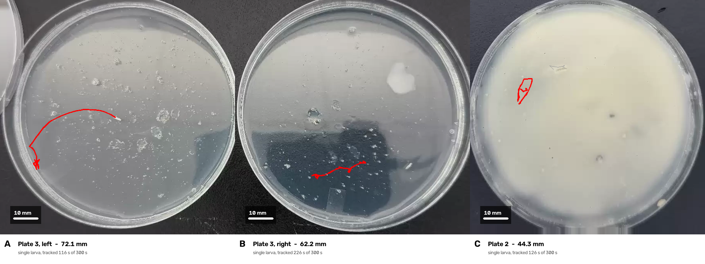
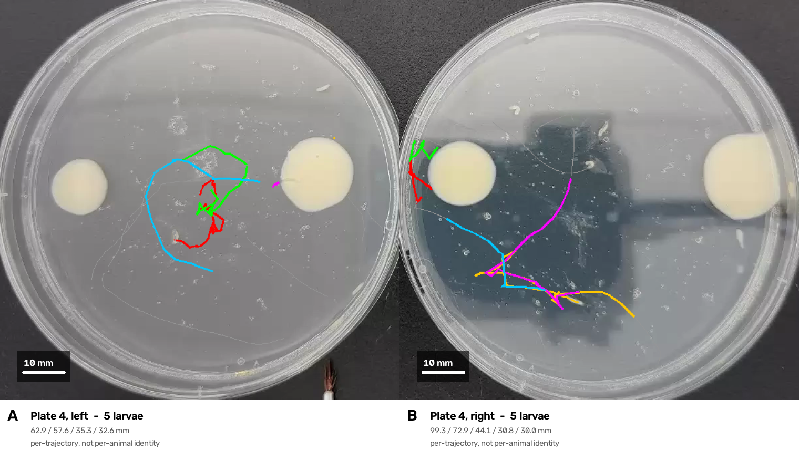
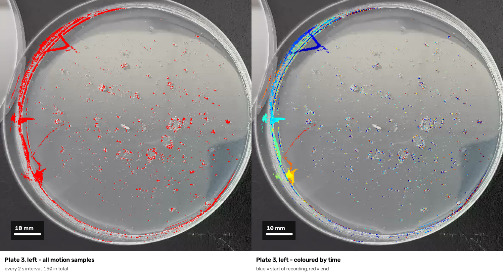

<div align="center">

# larvatrack

**Measures how far a *Drosophila* larva crawls in a petri dish, from a phone video.**

Built for a `for` gene foraging assay — rovers cover more ground than sitters,
and what you need out of a clip is one number: path length in millimetres.



*dish 3, left — 72.1 mm. The path is drawn in as it was walked, with the clock
and running distance burned in.
<a href="docs/demo_dish3L.mp4">Full-quality MP4</a>.*

</div>

### Figures



**Figure 1.** Reconstructed crawling paths for single-larva plates. Red traces
show the measured trajectory; scale bars 10 mm.



**Figure 2.** Plates containing five larvae, each trajectory in its own colour.
Lengths are per-trajectory and do not establish per-animal identity across gaps.



**Figure 3.** Raw motion evidence underlying the reconstruction. Left: every 2 s
interval in which something moved, accumulated over the recording. Right: the
same samples coloured by time (blue early, red late), showing the animal's
progress along the plate wall. Scattered flecks away from the trail are agar
debris flickering between frames, which is why detection alone is insufficient
and trajectories must be linked and filtered.

Regenerate with `.venv-track/bin/python make_figures.py` and
`.venv-track/bin/python make_heatmap.py`.

---

> ### One larva at a time
> This measures **a single animal per run**. Point it at a dish with five larvae
> and it reports whichever one it followed longest — not all five, and not their
> total. The solo-larva dishes (all-yeast, all-agar) are what it is for.

---

## What you give it

| | |
|---|---|
| **A clip** | MP4 or MOV, straight off the phone. Keep the camera still. |
| **Which dish** | Click a circle the detector found, or drag across the dish by hand. |
| **How wide it is** | In mm. Everything is scaled from this, so a wrong diameter gives a wrong answer with no other symptom. Standard dishes here are 100 mm. |

You get back the path length and the replay above, so you can see whether it
followed the larva or a speck of agar.

## Two ways to measure

**Automatic** — for a plate with one larva that stands out from the agar. Pick the
plate, give the diameter, press Measure. Works well on plain agar (validated to
−0.6% against a known path), and reports a lower bound because time the animal
was invisible contributes nothing.

**Hand-traced** — for everything automatic tracking cannot do honestly: several
larvae in a plate, a larva parked on a yeast spot, or a clip where the detector
keeps grabbing debris. You follow each animal with the pointer while the plate
plays back fast. It is slower to run and far more reliable, because identity
comes from the person watching, and a person does not lose an animal when two of
them cross.

Use hand-tracing whenever the automatic replay shows the path on the wrong thing.
Do not average the two — record which was used (the results file has a `method`
column) so a number can always be traced back to how it was obtained.

### Automatic, step by step

1. Pick a clip (a file already on this machine needs no upload).
2. Click an auto-detected plate, or drag across one to set it by hand.
3. Enter the plate diameter in mm. Everything is scaled from this.
4. **Measure the path.** The replay shows the path being walked — watch it.
5. If it followed the wrong thing, scrub to that moment, click the real larva,
   and **Re-measure with corrections**. Each pin overrules the tracker.

### Hand-traced, step by step

1. Pick the clip and set the plate as above.
2. **Follow with the mouse** — this takes over the full screen.
3. Choose a speed (20× by default; 300 s of plate becomes a smooth 15 s).
4. **Click the larva you want to follow.** That click is the path's first point,
   so the pointer's travel to it is not counted as distance.
5. After the 3-2-1 countdown, keep the pointer on that animal until the clip ends.
6. It saves and arms the next larva without leaving full screen. Previous
   starting points are marked and numbered so the same animal is not followed
   twice.
7. **Save hand-traced path(s)** when all animals are done. A JSON lands in
   `results/` with per-animal lengths and every clicked coordinate.

Keys while following: `1`–`5` switch animal, `space` pauses, `esc` closes.

The clip is re-encoded at the chosen speed rather than played faster, because a
browser asked for playbackRate 10 drops the frames it cannot decode in time and
the plate visibly jumps — which is exactly what a pointer cannot follow. Recorded
times are scaled back to real seconds, so 10× and 20× give the same answer.

## Running it

The measurement needs `trackpy`, hence a separate environment:

```bash
python3 -m venv .venv-track
.venv-track/bin/pip install trackpy opencv-python numpy pandas
.venv-track/bin/python app.py          # http://localhost:8020
```

`ffmpeg` must be on `PATH` for the replay video.

### From the command line

```bash
.venv-track/bin/python tptrack.py clip.mp4 \
    --dish-mm 100 --circle 568,549,297 \
    --replay out.mp4 --overlay out.png
```

| flag | |
|---|---|
| `--circle cx,cy,r` | the dish, in pixels |
| `--dish-mm` | its real diameter |
| `--larvae N` | crowded dish: report each trajectory separately |
| `--stabilise` | the camera moved during filming |
| `--replay` / `--overlay` | write the video / a still |

## Letting other people upload

```bash
./deploy.sh
```

Publishes the page to Vercel pointed at this machine through an ngrok tunnel.
The page is public; the measuring stays here, because the tracker needs OpenCV,
trackpy and minutes of CPU per clip — none of which fits in a serverless function.

- Clips are measured **one at a time**. Others queue and are told their position.
- Uploads go **in 4 MB chunks** with retries. Sent whole, a 120 MB clip is a
  72-second request that one network hiccup kills outright.
- This machine must be **awake and running `app.py`**.
- A free ngrok URL rotates on restart — re-run `./deploy.sh` and nothing else.

## How it measures

[`trackpy`](https://soft-matter.github.io/trackpy/) does detection and linking.
Rolling your own blob detector does not work here: the agar is covered in specks
the same size and shape as a larva, and a hand-written detector locks onto them.

trackpy still breaks one larva into several trajectories, because the animal
fades out against the dish wall. So:

- trajectories living out on the wall are dropped — that is glare, not an animal
- fragments join only across gaps short enough to be the same creature
- a gap against the wall is bridged **round** it, since that is where the larva
  went; mid-dish it is bridged straight, a lower bound by construction
- anything left over is reported separately rather than added in

> **The numbers are undercounts.** A five-minute clip typically yields two to
> four minutes of tracked path. Time the larva was invisible is not counted
> rather than guessed at.

Chaining every fragment together was tried and is worse — on one dish it welded
a glare fragment on the lid onto the real path, turning 72 mm into 153 mm.

## Checks

```bash
.venv-track/bin/python tptrack.py --self-check
```

Covers the bridging arithmetic, the wall arc, the speed cap, rejection of
over-long gaps, and the drift correction.

## Layout

| | |
|---|---|
| `tptrack.py` | the measurement, and the CLI |
| `app.py` | local server: upload, pick dish, measure, replay |
| `app.html` | the page |
| `deploy.sh` | publish the page, pointed at this machine |
| `trail.py` | older trail-area method, kept as a cross-check |
| `larvatrack.py` | earlier hand-rolled tracker; still used for dish auto-detection |

## Resolution matters more than you would think

The dish must be about **440 px across** in the clip. This is measured, not a
guess — the same recording downscaled, against its full-resolution answer of
72.1 mm:

| dish in frame | measured | error |
|---|---|---|
| 534 px | 71.4 mm | −1% |
| 445 px | 72.3 mm | +0% |
| 392 px | 112.4 mm | **+56%** |
| 297 px | 174.0 mm | **+141%** |
| 148 px | nothing found | — |

It does not degrade gracefully. Past the cliff it returns a confident wrong
number rather than a rough one, so clips below the threshold are refused instead
of measured. The detector width scales with the dish, which is what makes the
445 px case work at all.

**AirDrop, iMessage and iCloud Photos all shrink video.** Send the original file
off the phone, not a copy that has been through any of them.

## Known limits

- Needs a still camera and visible contrast between larva and agar. One test clip
  (white larvae on washed-out agar, handheld) fails, and `--stabilise` does not
  rescue it — that one needs reshooting.
- Dish diameter is trusted, not verified.
- Multi-larva mode gives per-trajectory lengths, not per-animal identities.
